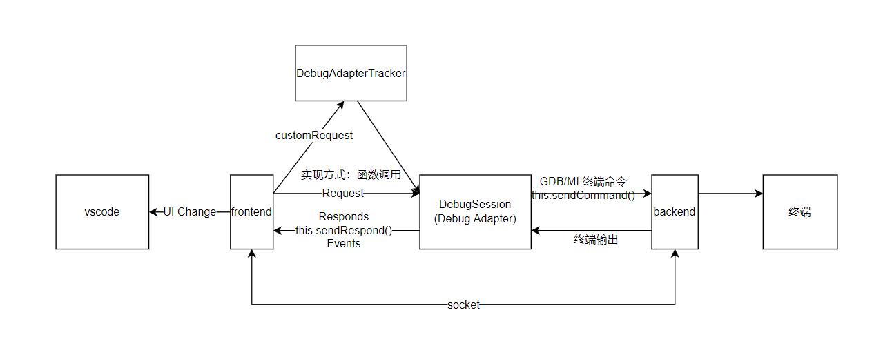
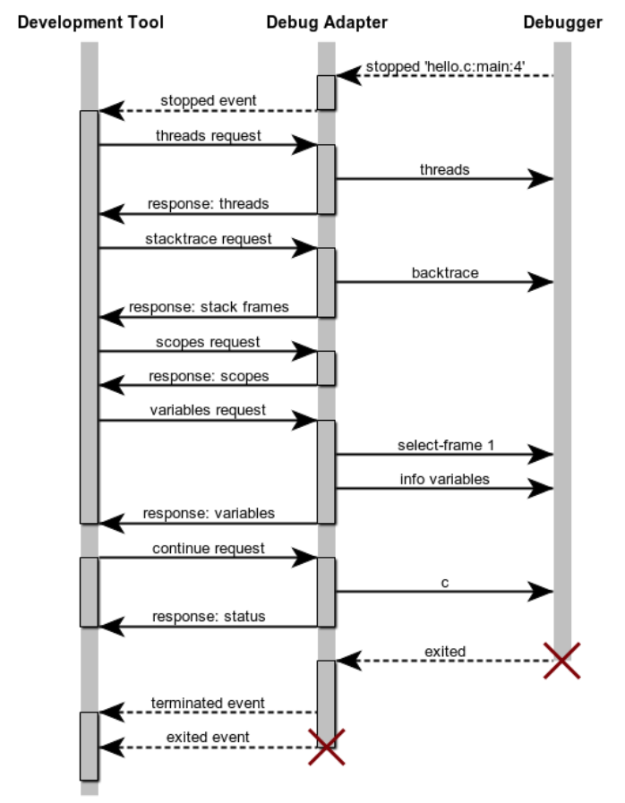
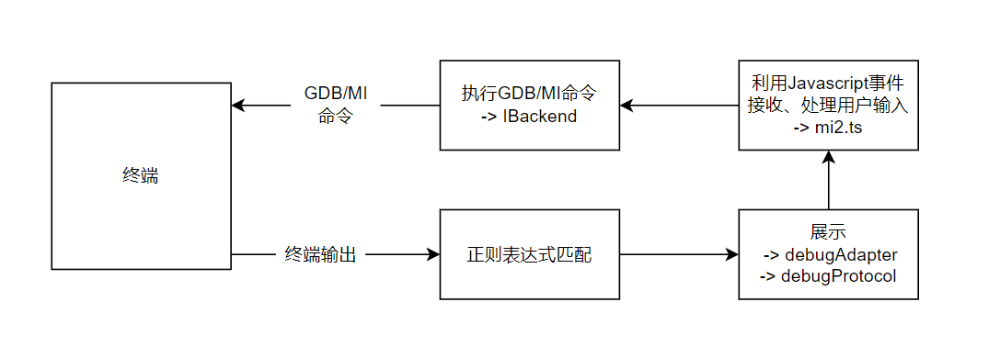
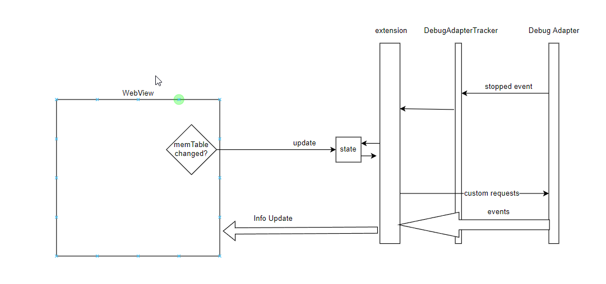

# proj158-rust-debugger
## 目录
- [proj158-rust-debugger](#proj158-rust-debugger)
  * [引言](#%E5%BC%95%E8%A8%80)
    + [项目背景](#%E9%A1%B9%E7%9B%AE%E8%83%8C%E6%99%AF)
    + [相关工作](#%E7%9B%B8%E5%85%B3%E5%B7%A5%E4%BD%9C)
      - [VS Code 中的调试架构](#vs-code-%E4%B8%AD%E7%9A%84%E8%B0%83%E8%AF%95%E6%9E%B6%E6%9E%84)
      - [DAP](#dap)
      - [GDBstub on qemu](#gdbstub-on-qemu)
  * [调试工具设计](#%E8%B0%83%E8%AF%95%E5%B7%A5%E5%85%B7%E8%AE%BE%E8%AE%A1)
    + [整体架构设计](#%E6%95%B4%E4%BD%93%E6%9E%B6%E6%9E%84%E8%AE%BE%E8%AE%A1)
    + [）Debug Adapter](#debug-adapter)
    + [GDB/MI Interface](#gdbmi-interface)
    + [os-specific](#os-specific)
    + [UI](#ui)
  * [调试工具实现](#%E8%B0%83%E8%AF%95%E5%B7%A5%E5%85%B7%E5%AE%9E%E7%8E%B0)
    + [关键的寄存器和内存的数据获取](#%E5%85%B3%E9%94%AE%E7%9A%84%E5%AF%84%E5%AD%98%E5%99%A8%E5%92%8C%E5%86%85%E5%AD%98%E7%9A%84%E6%95%B0%E6%8D%AE%E8%8E%B7%E5%8F%96)
    + [断点检测](#%E6%96%AD%E7%82%B9%E6%A3%80%E6%B5%8B)
    + [符号信息的获取](#%E7%AC%A6%E5%8F%B7%E4%BF%A1%E6%81%AF%E7%9A%84%E8%8E%B7%E5%8F%96)
      - [compile](#compile)
      - [rCore的修改](#rcore%E7%9A%84%E4%BF%AE%E6%94%B9)
    + [扩展DAP协议](#%E6%89%A9%E5%B1%95dap%E5%8D%8F%E8%AE%AE)
    + [调试信息的获取](#%E8%B0%83%E8%AF%95%E4%BF%A1%E6%81%AF%E7%9A%84%E8%8E%B7%E5%8F%96)
    + [获取特权级信息](#%E8%8E%B7%E5%8F%96%E7%89%B9%E6%9D%83%E7%BA%A7%E4%BF%A1%E6%81%AF)
    + [界面美化](#%E7%95%8C%E9%9D%A2%E7%BE%8E%E5%8C%96)
    + [特权及切换](#%E7%89%B9%E6%9D%83%E5%8F%8A%E5%88%87%E6%8D%A2)
      - [态的检测方法](#%E6%80%81%E7%9A%84%E6%A3%80%E6%B5%8B%E6%96%B9%E6%B3%95)
      - [gdb bug 不能在...设断点 => 流程](#gdb-bug-%E4%B8%8D%E8%83%BD%E5%9C%A8%E8%AE%BE%E6%96%AD%E7%82%B9--%E6%B5%81%E7%A8%8B)
      - [断点上下文](#%E6%96%AD%E7%82%B9%E4%B8%8A%E4%B8%8B%E6%96%87)
      - [符号文件的切换](#%E7%AC%A6%E5%8F%B7%E6%96%87%E4%BB%B6%E7%9A%84%E5%88%87%E6%8D%A2)
      - [Debug APIs](#debug-apis)
      - [UI(前段页面)](#ui%E5%89%8D%E6%AE%B5%E9%A1%B5%E9%9D%A2)
    + [性能测试与分析](#%E6%80%A7%E8%83%BD%E6%B5%8B%E8%AF%95%E4%B8%8E%E5%88%86%E6%9E%90)
  * [总结与展望](#%E6%80%BB%E7%BB%93%E4%B8%8E%E5%B1%95%E6%9C%9B)
  * [安装](#%E5%AE%89%E8%A3%85)
  * [使用](#%E4%BD%BF%E7%94%A8)
    + [功能](#%E5%8A%9F%E8%83%BD)
      - [系统调用](#%E7%B3%BB%E7%BB%9F%E8%B0%83%E7%94%A8)
      - [数据结构](#%E6%95%B0%E6%8D%AE%E7%BB%93%E6%9E%84)
    + [暂不可跟踪](#%E6%9A%82%E4%B8%8D%E5%8F%AF%E8%B7%9F%E8%B8%AA)
      - [Self变量（这是gdb的bug。见https://sourceware.org/gdb/onlinedocs/gdb/Rust.html）](#self%E5%8F%98%E9%87%8F%E8%BF%99%E6%98%AFgdb%E7%9A%84bug%E8%A7%81httpssourcewareorggdbonlinedocsgdbrusthtml)
      - [lazy_static! 变量（宏，返回值，难以跟踪）。如PCB,TCB](#lazy_static-%E5%8F%98%E9%87%8F%E5%AE%8F%E8%BF%94%E5%9B%9E%E5%80%BC%E9%9A%BE%E4%BB%A5%E8%B7%9F%E8%B8%AA%E5%A6%82pcbtcb)
  * [开发记录和知识库](#%E5%BC%80%E5%8F%91%E8%AE%B0%E5%BD%95%E5%92%8C%E7%9F%A5%E8%AF%86%E5%BA%93)

## 引言

### 项目背景

方便的源代码级调试工具，对监测程序运行状态和理解程序的逻辑十分重要；高效的Rust语言跟踪能力，是Rust操作系统内核开发的必要工具，对基于Rust的操作系统教学和实验很有帮助。然而现有RISC-V、Rust实验环境搭建成本高，上手难度大，不利于学习与开发工作。本项目拟实现一种基于网页访问的在线实验系统，提供方便、高效的手段实现在QEMU和RISC-V开发板上的Rust教学操作系统的源代码调试。

### 相关工作
#### VS Code 中的调试架构
VS Code基于Debug Adapter 协议，实现了一个原生的，非语言相关的调试器UI，它可以和任意后台调试程序通信。通常来讲，gdb等调试器不会实现Debug Adapter 协议，因此需要调试适配器（Debug Adapter）去“适配”这个协议，它一般而言是一个独立和调试器通信的进程。


#### Debug Adapter 协议
该协议主要由以下三个部分组成：
##### Events
此部分定义了调试过程中可能发生的事件
##### Requests
此部分定义了VSCode等调试器UI对Debug Adapter的请求
##### Responds
此部分定义了Debug Adapter对请求的回应
#### gdbstub on qemu
QEMU 支持通过远程连接工具访问 QEMU 中的 gdbserver。 这允许以与在真实硬件上使用 JTAG 等低级调试工具相同的方式调试客户代码。 可以停止和启动虚拟机，检查寄存器和内存等状态，并设置断点和观察点。
## 调试工具设计
### 整体架构设计




### Debug Adapter

本项目使用一个独立进程作为Debug Adapter连接VSCode与qemu的gdbstub。

#### 消息传递流程

该流程遵守Debug Adapter 协议。该协议主要规定了一下三类消息的结构和处理流程：

- Requests：各类消息请求的格式。本项目通过其中的CustomRequests扩展了一些操作系统调试相关的请求。
- Response：对于Requests的回应。
- Events：Debug Adapter事件。本项目新增的异步请求通过Events返回数据。

### GDB/MI Interface

GDB/MI是GDB面向机器的、基于行的文本接口。它用于支持将调试器作为Debugger插件的一个小模块来使用的系统开发。本项目通过`MIDebugger.sendCliCommand()`方法将用户请求（Debug Adapter Requests）转换为符合GDB/MI接口规范的文本并发送给GDB进程。

### 调试操作系统相关的功能
通过扩展Debug Adapter协议及其实现，使得调试器插件支持操作系统相关的调试功能
#### 特权级切换
调试器应能检测到特权级的切换并同步切换符号文件和断点。
### 用户界面

在VSCode已有的原生UI之外，本项目通过VSCode提供的WebView类，创建一个网页提供更丰富的用户交互界面。信息通过Node事件传入网页，通过函数调用输出至Debugger插件。


## 调试工具实现
编写代码时，我主要关注以下调试信息的处理流程：


### 关键的寄存器和内存的数据获取


csr等非通用寄存器也能看
### 断点检测

触发部分断点时，调试插件需要提特权级信息的更新。通过截获Debug Adapter触发的事件可以分析出当前触发的断点的行号和文件名。

### 符号信息的获取
#### 编译
通过修改`Cargo.toml`里的`debug=true`，`opt-level=0`两个参数使得rust编译器在编译时保留DWARF信息。
#### rCore的修改
rCore-Tutorial为了提升性能，在用户程序链接脚本`linker.ld`里面discard了`.debug_info`等段，修改链接脚本可以让链接器不忽略这些调试信息段。但这导致easy-fs的崩溃和栈溢出，故还需将easy-fs-fuse打包程序的磁盘大小，和栈空间改大。此外，user/目录要先 make clean 再编译，修改过的linkerscript才会生效。

### 扩展DAP协议
Debug Adapter 协议提供了`customRequest`,从而支持扩展协议内容。
扩展的协议内容如下：
#### 请求
寄存器请求
清除断点请求

#### 事件
特权级切换

### 获取特权级信息

risc-v处理器没有直接显示当前特权级的寄存器，故通过在代码中用户程序trap进入内核，和内核切换到用户程序二处设置断点，断点被出发时更新特权级信息。

### 界面美化

运用bootstrap等前端技术，提供对用户更加友好的图形界面：

### 特权级切换
#### 特权级的检测方法
在即将进入和离开内核处设置断点
#### gdb bug 不能在...设断点 => 流程
#### 断点上下文 
推测是执行sfence.vma之后，TLB刷新成用户进程的页表，导致内核地址空间的断点无法被设置。
#### 符号文件的切换
`add-file`

#### Debug APIs

本项目调用了一些VSCode API实现部分常用流程的自动化，例如自动删除断点、切换调试信息文件等。

#### UI(前端页面)

### 性能测试与分析


## 总结与展望

项目的主要工作：

1. 在VSCode编辑器的已有debugger插件基础上，扩展对Rust语言和操作系统内核特征的源代码级跟踪分析能力。主要包括：
    - 关键的寄存器和内存的数据获取；
    - 当前特树级信息的准确获取；
    - 函数调用栈跟踪；
    - 一个例子：在USM三态修改符号表，并获取内存单元信息；
    - 对被跟踪内核运行环境的适配：QEMU

2. 通过docker容器提供在线版本vscode、rust工具链以及qemu-system-riscv64等调试rCore-Tutorial-v3所需要的工具，使用户可通过网页远程调用云端qemu/RISC-V开发板的gdb调试器进行代码跟踪与调试。该部分已基本完成，见docker文件夹。待debugger插件功能稳定后上传docker hub。

todos:
- 支持展示更多内核数据结构


## 安装与使用
1. 推荐用ubuntu20.04虚拟机。其它版本请确保使用较新的`npm`和`node`。
1. 获取risc-v工具链
在[sifive官网](https://www.sifive.com/software)下载risc-v工具链（往下拉找到GNU Embedded Toolchain — v2020.12.8, 下载ubuntu版本），
或者试试直接访问
[这里](https://static.dev.sifive.com/dev-tools/riscv64-unknown-elf-gcc-8.3.0-2020.04.1-x86_64-linux-ubuntu14.tar.gz)。下载后将该文件复制到home目录下。
1. 参考[rCore指导书](https://rcore-os.github.io/rCore-Tutorial-Book-v3/chapter0/5setup-devel-env.html)配置rCore-Tutorial的环境。确保gdb和qemu在环境变量里。
1. 用nodesource安装nodejs 
1. 安装 vscode
1. 修改rCore-Tutorial-v3的源码和编译参数（diff文件可用vscode+diff插件观看）：[见此](./docs/rCore-mod.diff)
1. clone 本仓库，在仓库目录下`npm install`
1. 按f5启动插件
1. 修改src/frontend/fakeMakefile.ts里的`PROJECT_PATH`
1. 创建launch.json（选GDB）（可根据自己需要修改）: 
```json
{
    "version": "0.2.0",
    "configurations": [
        {
            "type": "gdb",
            "request": "attach",
            "name": "Attach to Qemu",
            "executable": "此处修改为rCore-Tutorial-v3所在目录/rCore-Tutorial-v3/os/target/riscv64gc-unknown-none-elf/release/os",
            "target": ":1234",
            "remote": true,
            "cwd": "${workspaceRoot}",
            "valuesFormatting": "parseText",
            "gdbpath": "此处修改为工具链所在目录/riscv64-unknown-elf-toolchain-10.2.0-2020.12.8-x86_64-linux-ubuntu14/bin/riscv64-unknown-elf-gdb",
            "showDevDebugOutput":true,
            "internalConsoleOptions": "openOnSessionStart",
            "printCalls": true,
            "stopAtConnect": true
        },
    ]
}
1. 在打开的新窗口内`Ctrl+Shift+P`找到并点击`CoreDebugger:Launch Coredebugger`
```

## 使用

1. 清除所有断点
1. 设置内核入口、出口断点
1. 按continue按钮开始运行rCore-Tutorial
1. 当运行到位于内核出口的断点时，插件会自动删除已有断点，此时用户可以设置用户态程序的断点
1. 在用户态程序中如果想观察内核内的执行流，应先清除所有断点，设置内核入口、出口断点

[视频演示](./docs/imgs/pre.mp4)
### 功能

#### 跟踪系统调用
用户->内核->用户

#### 跟踪内核数据结构
注：内核中的各种数据结构差异很大。此处列出可行的示例，欢迎感兴趣的大佬们继续添加


### 暂不可跟踪
#### Self变量
这是gdb的bug，见https://sourceware.org/gdb/onlinedocs/gdb/Rust.html
#### lazy_static! 变量（宏，返回值，难以跟踪）。如PCB,TCB
找到原因了。和lazy_static宏有关。简单来说，TASK_MANAGER结构体里确实只有__private_filed。TASK_MANAGER里的值通过宏里的deref()函数返回。函数返回值跟踪起来很麻烦，所以曲线救国，把TaskManager的地址复制到另一个全局变量里（这在c里很容易做到，在rust里略麻烦）。
不靠谱的方法：
#### 包含Vec和VecDeque的数据结构
Vec和VecDeque的pointer值通过gdb查看是错的（都是0x1,0x2之类的很小的值）。直接看内存可以得到正确结果
#### 被内联展开的函数

## 开发记录和知识库

[在线版本(观看效果更佳)](https://shimo.im/docs/hRQk6dXkxHp9pR3T)

[离线版本](./docs/%E5%BC%80%E5%8F%91%E8%AE%B0%E5%BD%95%E5%92%8C%E7%9F%A5%E8%AF%86%E5%BA%93.pdf)

## 分工与协作