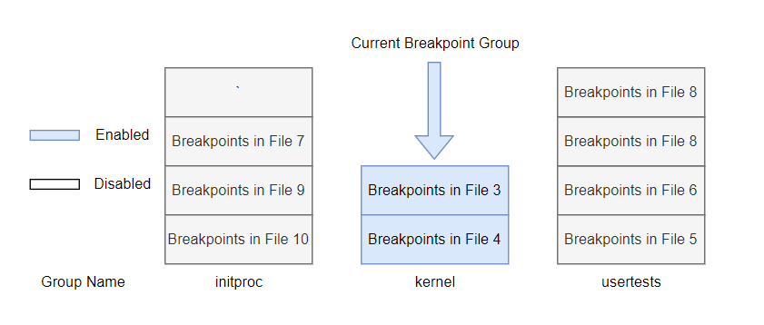

# proj158
支持Rust语言的源代码级内核调试工具

#
#

**指导老师**：吴竞邦 （北京工商大学）

**团队成员**：陈志扬 余叶 黄宗益 （北京工商大学）

---

## 起因
- rCore-Tutorial 实验
	- 环境配置繁琐
	- GDB TUI不方便
---
## 在线调试系统
- 浏览器打开即用
	- 类似github classroom
	- 提供在线VSCode
- 调试者与被调试内核分离
- VSCode插件支持操作系统相关的调试功能
	- 插件也可以在本地版本VSCode上使用

---
## 功能
- 寄存器
- 内存
- 断点
	- 支持在内核态设置用户态程序的断点
- 当前特权级
- 本地变量
- 自定义GDB语句
- 自动加载符号信息文件

---
## 调试工具设计与实现
- 服务器
- 用户端
- 内核态用户态的断点冲突

---

## 服务器
- 基于 `openvscode-server`提供网页版vscode
- 提供qemu、rust工具链、gdb
- 自动编译、加载内核和GDB

---
## 符号信息的获取
- `Cargo.toml`编译参数
	- `debug=true`
	- `opt-level=0`
		- 修改easy-fs-fuse
		- `USER_HEAP_SIZE`
		- ...
- `linker.ld`
	- 保留*.debug段

---

## Debug Adapter
- 负责协调VSCode和GDB的独立进程。
- 消息类型
	- Request
	- Response
	- Event
- Debug Adapter Protocol
	- 大量customRequest

---
## 用户端
- Extension Frontend
	- 消息监听与转发
	- Debug UI
	- WebView

---
## 内核态用户态的断点冲突
- GDB限制：无法在内核态设置用户态代码的断点
	- 可能与页表刷新有关
- 解决思路：暂存断点，待时机合适再设置断点
---
## 断点组
- 在内核即将进入用户态，以及trap_handler处设置断点
- “进出口断点”被触发时清空断点，设置新断点
- 缓存暂时无法设置的断点，待时机合适再设置

- 扩展：内存信息也可以如此“切换“
---

## 特权级切换处理
- 切换符号表文件
	- `add-file` -> GDB
- 切换断点组
- 更新当前所在特权级
	- risc-v处理器无寄存器能显示反映当前特权级
	- 借助“边界”断点、地址空间、文件名判断
---
## 局限
- gdb的bug
	- Self变量
	- Vec, VecDeque
		- 可查看但输出信息有误
- lazy_static!宏
- 被内联展开的函数

---
## 扩展
- 支持其他OS
	- 获取符号表信息（例如vmlinux）
	- 确定内核“出入口”断点
	- 修改当前特权级判断逻辑
	- 修改断点组判断逻辑
- 观察其他内核数据结构
	1. 添加`customRequest`，
		1. 收集数据：GDB命令（mi2.ts）
		1. 返回信息：Events/Responses
	1. 插件进程解析Events/Responses并转发至WebView（extension.ts）
	2. 添加WebView界面(extension.ts)

---
## todos
- 更多os
- 更多内核数据结构
	- 如进程控制块
- WebView -> TreeView
---
## 项目仓库
https://github.com/chenzhiy2001/code-debug

---

## 谢谢！
---

