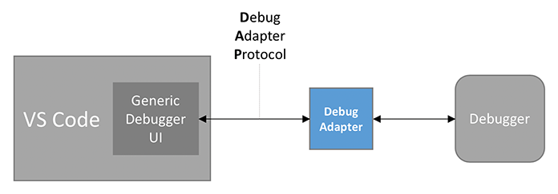

# CoreDebugger
支持Rust语言的源代码级内核调试工具

---

## 起因
- rCore-Tutorial 实验
	- 环境配置繁琐
	- GDB TUI不方便
---
## 在线调试系统
- 浏览器打开即用
	- 类似github classroom
- 对操作系统调试有较好支持
- docker镜像
- vscode插件
---
## docker镜像
- 基于 openvscode-server 
- rust、risc-v工具链
- 网页版vscode
---
## vscode插件
- 操作系统相关的调试功能
- 支持本地、网页版本vscode
- 功能
- 原理
- 扩展
---
## 功能
- 寄存器
- 内存
- 断点
	- 支持在内核态设置用户态程序的断点
- 当前特权级
- 本地变量
- 自定义GDB语句
- 自动加载符号信息文件

---
## 符号信息的获取
- Cargo.toml
	- `debug=true`
	- `opt-level=0`
		- 修改easy-fs-fuse
		- USER_HEAP_SIZE
		- ...
- linker.ld
	- 保留*.debug段

---

## 获取寄存器、内存信息
- Debug Adapter Protocol
	- 大量customRequest
- Debug Adapter
	- 消息类型
		- Request
		- Response
		- Event

---
## 特权级切换处理
- 符号表文件
	- `add-file` -> GDB
- 断点
	- GDB限制：无法在内核态设置用户态代码的断点
	- 解决办法：暂存，待时机合适再设置断点
- 当前所在特权级
	- risc-v处理器无寄存器能显示反映当前特权级
	- 借助“边界”断点、地址空间、文件名判断
---
## 断点的保存与恢复
- 问题：GDB无法在内核时设置用户态程序的断点
	- 可能与页表刷新有关
- 解决思路：
	- 在内核“进出口”处设置断点
	- “进出口”被触发时清空断点，设置新断点
	- 缓存暂时无法设置的断点，待时机合适再设置
	- 实现：
		- `AddressSpaces`
---
## `AddressSpaces`
- 管理“切换”相关功能
- `spaces:AddressSpace[];`:断点组
- `updateCurrentSpace`:触发断点时，更换断点组
- `saveBreakpointsToSpace`:添加新断点时，根据当前特权级缓存、设置断点
- 扩展：内存信息也可以如此“切换“
---

## 常用API

---

## 插件主进程（extension.ts）
- 监听Debug Adapter和VSCode的通信
	- `stopped`：向Debug Adapter请求更新WebView信息
	- 自定义事件：
		1. 转发消息至WebView
		2. 特权级切换处理
- Debug Adapter Protocol
	- 发送：`Request`
	- 响应：`Response`,`Event`

---
## 时机合适？
- 在内核即将进入用户态，以及trap_handler处设置断点
- 每当触发断点时，都检测这个断点是否是上述两个内核“边界”处的断点
- 若是，添加符号表文件，移除当前所有断点，加载用户态程序的断点，更新WebView信息。

---

## 局限
- gdb的bug
	- Self变量
	- Vec, VecDeque
		- 可查看但输出信息有误
- lazy_static!宏
- 被内联展开的函数

---
## 扩展
- 支持其他OS
	- 获取符号表信息（例如vmlinux）
	- 确定内核“出入口”断点
	- 修改当前特权级判断逻辑
	- 修改断点组判断逻辑
- 观察其他内核数据结构
	1. 添加`customRequest`，
		1. 收集数据：GDB命令（mi2.ts）
		1. 返回信息：Events/Responses
	1. 插件进程解析Events/Responses并转发至WebView（extension.ts）
	2. 添加WebView界面(extension.ts)

---
## todos
- 更多os
- 更多内核数据结构
	- 如进程控制块
- WebView -> TreeView
---

## 谢谢！
---

