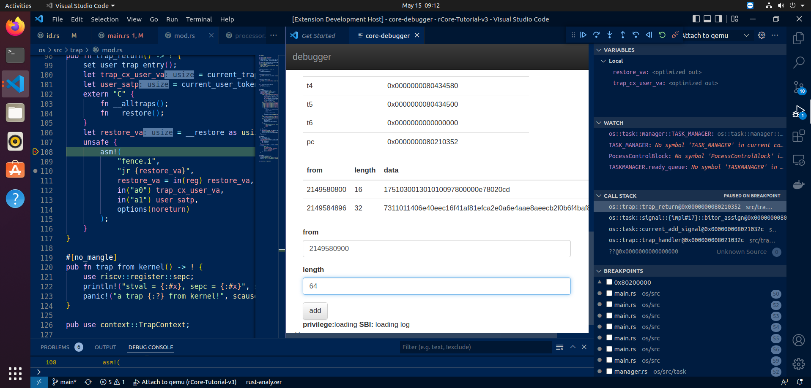

# CoreDebugger
支持Rust语言的源代码级内核调试工具

---

## 起因
- gdb调试rCore
- TUI调试不便
	- 代码文件较多
	- 频繁切换符号文件
---
## 功能
- 可结合rust-analyzer等插件使用
- 获取当前特权级
- 寄存器和内存数据
- 在内核态设置用户态的断点
- 系统调用跟踪
- 保留文本控制台

---

## 设计
- WebView
- 插件进程（extension.ts）
- Debug Adapter
- Backend
	- 通信方式：管道
	- 协议：GDB/MI Interface
- GDB
	- risc-v工具链，连接gdbserver
- Qemu
	- `gdbstub` => gdbserver
---
## 常用API

---
## WebView
- 信息窗口
- 功能按钮

---
## 插件主进程（extension.ts）
- 监听Debug Adapter和VSCode的通信
	- `stopped`：向Debug Adapter请求更新WebView信息
	- 自定义事件：
		1. 转发消息至WebView
		2. 特权级切换处理
- Debug Adapter Protocol
	- 发送：`Request`
	- 响应：`Response`,`Event`
---
## 特权级切换处理
- 符号表文件
	- `add-file` -> GDB
- 断点
	- GDB限制：无法在内核态设置用户态代码的断点
	- 解决办法：暂存，待时机合适再设置断点
- 当前所在特权级
	- risc-v处理器无寄存器能显示反映当前特权级
	- 借助“边界”断点、地址空间、文件名判断
---
## 时机合适？
- 在内核即将进入用户态，以及trap_handler处设置断点
- 每当触发断点时，都检测这个断点是否是上述两个内核“边界”处的断点
- 若是，添加符号表文件，移除当前所有断点，加载用户态程序的断点，更新WebView信息。

---

## `AddressSpaces`
- 管理“切换”相关功能
- `spaces:AddressSpace[];`:断点组
- `updateCurrentSpace`:触发断点时，更换断点组
- `saveBreakpointsToSpace`:添加新断点时，根据当前特权级缓存、设置断点
- 扩展：内存信息也可以如此“切换“
---

## 符号信息的获取
- Cargo.toml
	- `debug=true`
	- `opt-level=0`
		- 修改easy-fs-fuse
		- USER_HEAP_SIZE
		- ...
- linker.ld
	- 保留*.debug段

---
## 局限
- gdb的bug
	- Self变量
	- Vec, VecDeque
		- 可查看但输出信息有误
- lazy_static!宏
- 被内联展开的函数

---

## 谢谢！
---

