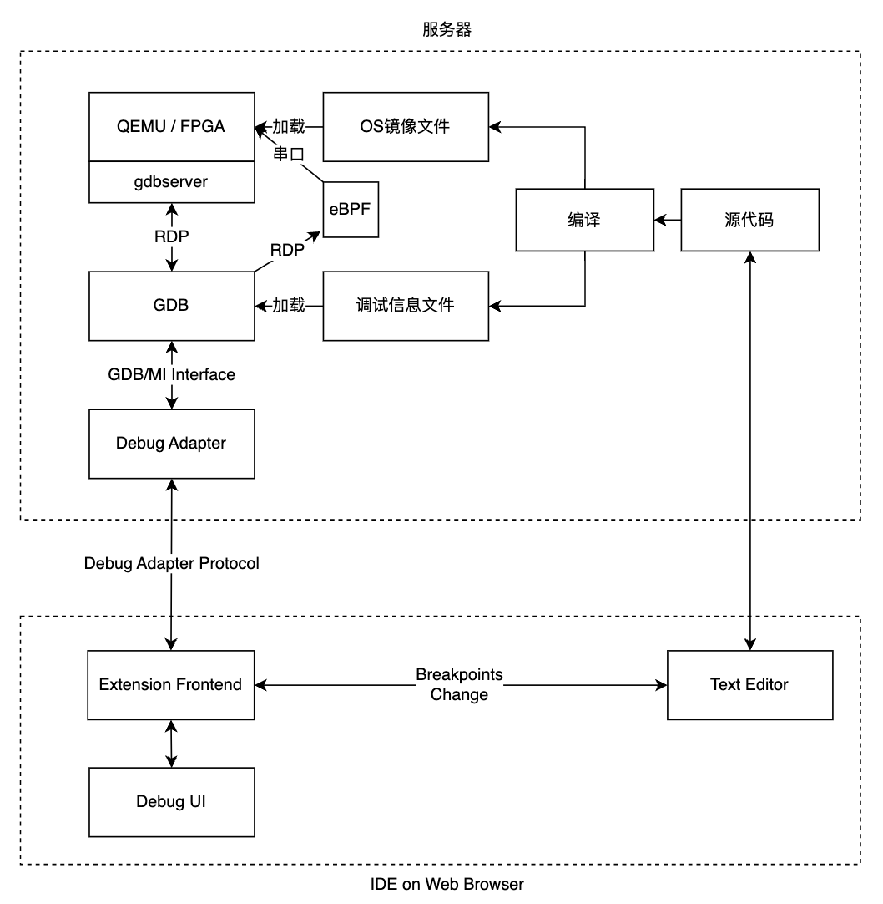
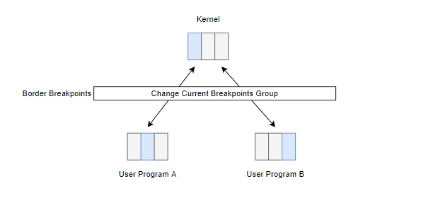

# 面向rCore-Tutorial操作系统的调试工具

## 摘要

方便的源代码级调试工具，对监测程序运行状态和理解程序的逻辑十分重要，尤其是相对复杂的内核代码以及用户
态、内核态的系统调用交互；高效的 Rust 语言跟踪能力，是 Rust 操作系统内核开发的必要工具，对基于 Rust
的操作系统教学和实验很有帮助。然而现有 RISC-V、Rust 实验环境搭建成本高，上手难度大，不利于初学者的内
核学习与开发工作。

我们实现了一种基于 VSCode 以及云服务器的内核源代码远程调试工具：在云服务器中部署 QEMU 虚拟机并运行
Rust 操作系统，通过操作系统的 eBPF 模块和 QEMU 提供 GDB 接口与用户本地的网页或安装版 VSCode 进行连接
，实现远程单步断点调试能力，提供一种对用户友好的 Rust 内核代码、用户态代码以及系统调用代码的调试方法
。

关键词：

## 第一章 引言

### 1.1 项目背景

rCore-Tutorial-v3 是一个基于 RISC-V 平台的、由 Rust 语言编写的类 Unix 教学操作系统。我们在做这个操作
系统的配套教学实验时发现，很多同学浪费了大量时间在安装 QEMU 虚拟机，Rust 工具链等环境上；配置好环境
之后，由于缺乏一个比较方便的调试手段，难以对操作系统的运行有深入的理解。

针对这两个问题，我们开发了一套在线调试系统。通过这套在线调试系统，用户不需要在自己的计算机上配置环境
，通过浏览器就可以编写、调试操作系统代码。这套在线调试系统同时配备了一套调试工具，具备和操作系统开发
密切相关的调试跟踪功能。

市面上的现有产品，例如 Github Codespaces[114514], 由于没有开放源代码，使用、部署的限制比较大。它可以
利用 Qemu 虚拟机的 gdbstub[]特性支持基于 gdb 的调试，但只能使用文本终端，翻阅代码很不方便，对于初学
者来说有较大学习成本。而且它不具备和操作系统开发密切相关的调试跟踪功能。

### 1.2 相关工作

#### 1.2.1 基于 Visual Studio Code 的在线调试方案

近年来，具有高度的可定制性的轻量级集成开发环境，如 Sublime Text、Atom 和 Visual Studio Code，已经迅
速普及。然而，轻量级 IDE 对操作系统在线调试的支持非常有限。在线调试的优势是,对本地计算机性能要求不高，无
需在本地配置开发环境，便于分享协作，可以构建高效的程序开发教学平台。

鉴于轻量级集成开发环境的日益普及，以及我们对操作系统在线调试支持的局限性的观察，我们基于
Visual Studio Code（最流行和最广泛使用的轻量级IDE之一）设计和实现了一个操作系统在线开发、调试环境。

## 第二章 调试工具设计与实现

### 2.1 整体架构设计

我们设计的在线调试系统通过调试者和被调试内核分离的设计来实现 Qemu 虚拟机或真实系统上的操作系统远程调
试。内核在服务器上运行，用户在浏览器里发送调试相关的请求，如下图所示。

图中 Source Code 是待编译的操作系统的源代码，当用户发出编译请求时，服务器中的 rust 工具链会通过特定
的编译参数编译操作系统源代码，产生满足操作系统调试要求的操作系统镜像和调试信息文件。如果用户接下来发
出调试请求，服务器中的 Qemu 或服务器连接的 FPGA 硬件就会加载操作系统镜像（本项目以 Qemu 为例），服务
器中的 GDB 会加载调试信息文件并连接至 Qemu 的 gdbserver。

图中 Extension Frontend 是运行在用户浏览器中负责操作系统调试相关功能的模块。Debug Adapter 是运行在服
务器中的独立进程，负责处理 Extension Frontend 发送来的请求。当 GDB 成功加载调试信息文件并连接至 Qemu
的 gdbserver 后，Debug Adapter 进程启动并开始接收 Extension Frontend 发送来的请求。Debug Adapter 会
将请求转换为 GDB 指令发送给 GDB。GDB 在执行完 GDB 指令后将 GDB/MI 格式的信息返回给 Debug
Adapter。Debug Adapter 解析后将结果返回给 Extension Frontend。

如果用户开启了 eBPF 跟踪功能，相关的eBPF模块会随着GDB的启动而激活，提供更加强大和灵活的动态跟踪调试功能。

Extension Frontend 收到 Debug Adapter 发送来的消息后，会将这些消息转换为界面更新消息，发送给 IDE on
Web Browser 上的调试界面（图中 Debug UI）和文本编辑器模块（图中 Text Editor）。同样，Debug UI 和
Text Editor 也可以向 Extension Frontend 发送消息，比如断点更新消息。

要完成以上的流程，服务器中需安装 openvscode-server、调试插件、Qemu，GDB，rust 工具链。用户可以手动配
置服务器中的安装这些软件，也可以使用我们配置好的包含以上工具的 docker 容器，免去了配置的麻烦。

接下来我们分服务器和网页端两个部分介绍这套远程调试工具。

### 2.2 Server Side

#### 2.2.1 在线 VSCode

OpenVSCode Server 是 VS Code 的一个分支，它在 VSCode 原有的五层架构的基础上增加了服务器层，使其可以
提供一个和 VSCode 功能相近的，通过浏览器即可访问的在线IDE。这个在线IDE可以和服务器上的开发环境、调试环
境通信。

用户可以在在线 IDE 上编辑项目源代码，同时可以远程连接到服务器上的终端。我们在服务器里配置好了 Qemu 虚拟
机和 GDB、Rust 工具链。用户可以自行通过终端命令使用 Qemu、GDB 等工具手动调试自己编写的操作系统，也可以
通过在线 IDE 中的操作系统调试模块进行更便利的调试。

如果用户选择用操作系统调试模块进行调试，操作系统调试模块做的第一步是编译内核并获取操作系统镜像文件
和调试信息文件。接下来我们以 rCore-Tutorial-v3[5]操作系统为例，阐述如何获取这两类文件。

#### 2.2.1 编译

在使用默认编译参数的情况下，rCore-Tutorial-v3 编译出的操作系统镜像和调试信息文件难以用于操作系统
调试。这是因为 rCore-Tutorial-v3 操作系统基于rust语言编写，使用rustc编译器。在默认情况下，
rustc编译器会对代码进行比较激进的优化，例如内连函数，删除大量有助于调试的符号信息。因此，我们
需要修改编译参数，以尽量避免编译器的优化操作。

rCore-Tutorial-v3 是用 cargo 工具创建的。一般情况下，用 cargo 工具创建的 rust 项目可用
release, debug 两种模式进行编译，其中 release 模式对代码进行较高等级的优化，删除较多调试相关
的信息，而 debug 模式则对代码进行较弱等级的优化并保留了更多调试相关的信息，比较符合我们的需求。
但是，rCore-Tutorial-v3 项目本身不支持使用 debug 模式进行构建。所以，为了正常进行调试
，需要修改 release 模式下的配置文件，关闭代码优化，保留调试信息。

此外，rCore-Tutorial-v3 为了提升性能，在用户程序链接脚本 linker.ld 里 discard 了.debug_info 等段，修
改链接脚本可以让链接器不忽略这些调试信息段。接着通过 cargo clean 命令清空已编译的文件，使链接脚本的
修改生效。

保留 debug 所需的 DWARF 段[114514]后，用户程序占用的磁盘空间变大，导致 easy-fs 文件系统的崩溃和栈溢
出，故还需将 easy-fs-fuse 磁盘打包程序的相关参数，如磁盘大小，改大。此外，用户程序运行时占用的内存也
会增加，故用户堆栈、内核堆栈大小等均需调整。

本项目将这些对于配置文件、链接脚本、操作系统源代码的修改整理成一个 diff 文件，用户只需要在远程终端中
通过一个 git 命令应用这个 diff 文件即可完成上述修改。

#### 2.2.3 Qemu 和 GDB

在编译完成后，服务器上的 Qemu 会加载操作系统镜像，并开启一个 gdbserver。接着，GDB 加载符号信息文件并
连接到 Qemu 提供的 gdbserver。

GDB 可以解析服务器内其他进程传递的符合 GDB/MI 接口规范的文本数据。GDB/MI 是 GDB 面向机器的、基于行的
文本接口。它用于支持将调试器作为 Debugger 插件的一个小模块来使用的系统开发。[2]

#### 2.2.4 Debug adapter

Debug Adapter 是负责协调代码编辑器和 debugger（在本项目中为 gdb）的一个独立的进程。在 GDB 准备就绪后
，Debug Adapter 进程会启动，开始监听用户浏览器中 Extension Frontend 模块发送来的调试请求。

一旦 Debug Adapter 接收到一个请求，它就会将请求（Debug Adapter Requests）转换为符合 GDB/MI 接口规范
的文本并发送给 GDB。GDB 在解析、执行完 Debug Adapter 发来的信息后，返回符合 GDB/MI 规范的文本信息
。Debug Adapter 将这些信息解析后，向 Extension Frontend 返回 Responds。此外，调试过程中发生的特权级
切换、断点触发等事件也会通过 Event 类型的消息返回给 Extension Frontend。

 我们编写了一个插件。这个插件可以在云端也可以在本地
运行。目前为了调试的方便，我们基本上在本地运行。

### 2.3 IDE on Web Browser

#### 2.3.1 Extension Frontend

Extension Frontend 在用户浏览器端运行，和服务器上的 Debug Adapter 通信。它监听 Debug Adapter 接收和
发出的消息并发送 Requests，相应 Responses 和 Events。Extension Frontend 会解析接收到的 Responds 和
Events 并将需要的信息转发至 Debug UI。如果 Debug UI 向 Extension Frontend 传递了某个消息，Extension
Frontend 也会将这个消息转换为 Requests 发送给 Debug Adapter。

#### 2.3.2 Debug UI

TODO

### 2.4 内核态用户态的断点冲突

要实现操作系统调试功能的关键问题在于同时设置内核态、用户态的断点，但是用户态、内核态的断点设置是冲突
的。这是由于 GDB 根据内存地址设置断点，但是内核态切换到用户态时 TLB 会刷新。例如：rCore-Tutorial-v3
操作系统运行在内核态时，如果令 GDB 设置用户态程序的断点，这个用户态的断点不会被触发。原因是特权级切
换时执行了 risc-v 处理器的 sfence.vma 指令，使得 TLB 刷新成用户进程的页表，导致之前在内核地址空间设
置的断点失效。

解决这个问题的核心思路是，缓存设置后会造成异常情况的断点，待时机合适再令 GDB 设置这些断点。在用户态
运行时，缓存内核态断点；在内核态运行时，缓存用户态断点。为此，我们在 Debug Adapter 中新增了一个断点
组管理模块。

断点组管理模块用一个词典缓存了用户要求设置的（包括内核态和用户态）所有断点。词典中某个元素的键是内存
地址空间的代号，元素的值是这个代号对应的断点组，即这个内存地址空间里的所有断点。当任何一个断点被触发
时，Debug Adapter 都会检测当前触发的这个断点属于哪个断点组。包含了最新触发断点的断点组称为当前断点组
（Current Breakpoint Group）

当用户在 VSCode 编辑器中设置新断点时，Debug Adapter 会收到一个请求设置断点的 Request。Debug Adapter
中的断点组管理模块会先将这个断点的信息存储在对应的断点组中，然后判断这个断点所在的断点组是不是当前断
点组，如果是的话，就令 GDB 当即设置这个断点。反之，如果不是，那么这个断点暂时不会令 GDB 设置。

在这样的缓存机制下，GDB 不会同时设置内核态和用户态断点，因此避免了内核态用户态的断点冲突。接下来需要
一个机制，在合适的时机进行断点组的切换，保证某个断点在可能被触发之前就令 GDB 设置下去。显然，利用特
权级切换的时机是理想的选择。本项目在内核态进入用户态以及用户态返回内核态处，设置断点。我们称这两个断
点为边界断点。如果这两个断点被触发，就意味着特权级发生了切换，进而内存地址空间也会发生切换，因此断点
组也应当切换。我们令 Debug Adapter 每次断点被触发时都检测这个断点是否是边界断点。如果是的话，先移除
旧断点组中的所有断点，再设置新断点组的断点。如下图所示。

为了保证相关功能正常运作，断点组切换时，符号表文件也应随着断点组的切换而切换。

### 2.5 案例：当前特权级检测

调试操作系统与调试一般应用程序的一大区别是，调试操作系统时用户经常需要关注当前运行在什么特权级上。因
此，操作系统调试工具需要有检测当前特权级的功能。我们以特权级检测为例，展示这个操作系统调试工具的典型
处理流程。

当 Extension Frontend 监听到 GDB 触发断点、用户手动暂停、或 Debug Adapter 发送了 stopped Event 时
，Extension Frontend 发送一个 customRequest 请求 Debug Adapter 返回当前特权级、寄存器数据、内存数据
、断点列表等信息。

接着 Debug Adapter 响应这些请求，向 GDB 发送命令。RISC-V 处理器没有寄存器可以透露当前的特权级，因此
不能直接通过 info registers 这个 GDB 命令获得当前特权级。Debug Adapter 会尝试获取当前执行的代码的内
存地址和文件名，进而判断当前的特权级。

在得到当前所在的特权级后，Debug Adapter 向 Extension Frontend 返回 Responses。Extension Frontend 接
收并解析 Responses 和 Events，将信息传递到 Debug UI。Debug UI 收到信息后更新界面。

### 第四章 基于 eBPF 技术的跟踪调试

由于 GDB 对 rust 语言支持的局限性，以下语言元素暂不支持查看： TODO 因此，我们希望利用 eBPF 技术，和
qemu 的 gdbserver 的静态分析互补。支持查看这些语言元素，从而可以展示更多内核信息。

### 4.1 eBPF 技术简介

扩展的伯克利包过滤器（eBPF）是一种革命性的技术，它提供了对内核的强大的监控和追踪功能。通过使用
kprobe，eBPF 技术能够在内核空间中收集各种类型的信息，然后将这些信息存储在 BPF maps 中。eBPF 的主要优
势在于其高效和灵活。因为 eBPF 程序运行在内核空间，所以它比传统的用户空间工具更高效。此外，eBPF 程序
的可编程性使得它可以定制以收集特定类型的数据，满足各种复杂的监控需求。

### 4.2 gdbserver 协议与 eBPF server 的不同

gdbserver 是一个通用的调试服务器协议，它提供了一种同步的消息交换机制。相比之下，eBPF server 则以异步
的消息为主。这种异步的消息处理方式提供了更高的并发性和响应性。然而，异步的消息可能会与同步的消息重合
。在这种情况下，我们可以使用一种称为"%"的机制来处理这种冲突。这种机制可以确保消息的有序交付和处理。

eBPF的gdbserver只有强的动态跟踪能力；
控制只能通过QEMU的gdbserver来实施；

eBPF依赖的内核模块是不能自己调试的；
eBPF的调试依赖内核的两个串口；

实现：移植，升级，系统调用，helpers，对eBPF以外的符号信息的依赖；

RDP协议简介

### 4.3 使用 gdb 的 Python 扩展

为了提高调试的灵活性和效率，我们可以使用 gdb 的 Python 扩展。这个扩展允许我们使用 Python 语言来编写
自定义的调试命令和脚本。为了使用这个扩展，我们需要重新编译 gdb。

我们可以使用 Python 脚本来编写一些自定义的调试命令和行为。这些脚本通常运行在一个单独的线程中，以不阻
塞主调试会话。我们可以使用 Python 的强大功能和易用性来编写复杂的调试逻辑和处理程序。

### 4.4 QEMU 对新串口的支持

为了实现更好的设备模拟，我们可以使用 QEMU 来支持新的串口。有两个主要的原因让我们选择使用第二个串口。
首先，我们可以使用物理内存保护（PMP）来保护串口的内存区域。其次，我们可以利用基于中断的串口消息收发
机制来提高效率。由于这个机制的存在，消息不能返回 server，而是直接由 eBPF 程序返回。此外，我们还可以
利用 QEMU 的 virtio 设备模型来模拟虚拟串口，以提供更高的性能和灵活性。

根据赵方亮学长给的链接找到了线索，修改了sbi的pmp设置，实现了基于中断的多串口数据收发，可以正常收发字符串。

基于中断的串口消息收发原理

### 4.5 在VSCode结合gdbserver和eBPF

总的来说，这些技术的结合为我们提供了一种新的方式，以更高效、更灵活的方式进行系统调试和监控。尽管这些
技术各自具有一定的复杂性，但是它们的组合无疑将为我们在未来的系统设计和开发中提供巨大的可能性和潜力。

### 4.6 调用规范，函数参数的收集方法

### 4.7 案例

### 第五章 总结与展望

### 5.1 总结

本项目的主要工作是在 VSCode 编辑器的已有 debugger 插件基础上，扩展对 Rust 语言和操作系统内核特征的源
代码级跟踪分析能力。实现的功能主要包括：

1. 关键的寄存器和内存的数据获取；
2. 在内核态时设置用户态程序的断点；
3. 当前特权级信息的准确获取；
4. 自动更换符号表文件；
5. 函数调用栈跟踪；
6. 一个例子：在 USM 三态修改符号表，并获取内存单元信息；
7. 对被跟踪内核运行环境的适配：QEMU

总的来说，通过结合使用 eBPF 技术、gdbserver 协议、Python 扩展和 QEMU 的新串口支持，我们可以构建一个
高效、灵活且功能强大的系统调试和监控平台。 eBPF 技术、gdbserver 协议、Python 扩展以及 QEMU 新串口的
支持，都在各自的领域中展示了出色的性能和灵活性。在这篇论文中，我们探索了如何将这些技术组合在一起，以
创建一个功能强大且高效的系统调试和监控平台。

通过 eBPF 技术，我们可以获取和存储大量的内核空间信息，从而更好地理解系统的运行状态。借助 gdbserver
协议和 Python 扩展，我们可以编写复杂的调试逻辑和处理程序，从而更好地控制和管理系统的运行。最后，通过
QEMU 新串口的支持，我们可以实现更高效的设备模拟，从而更好地满足系统的硬件需求。

### 5.2 展望

信息获取能力增强：uprobe、函数调用栈（参数和返 回值=>火焰图等信息展示）、异步函数调用栈；在真板子上获取信息；
断点和插桩自动选择

## 参考文献

## 致谢
